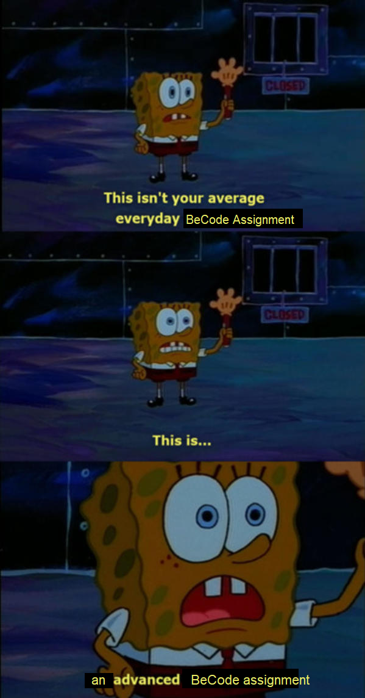
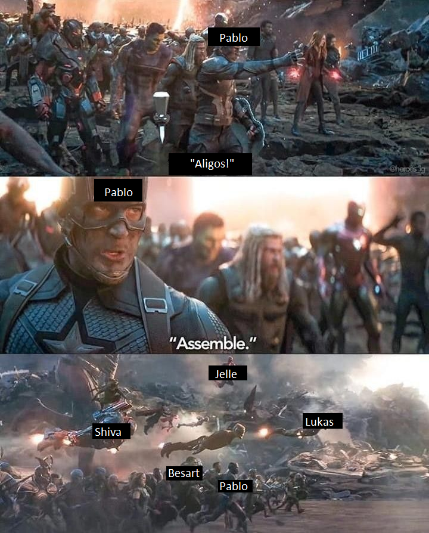
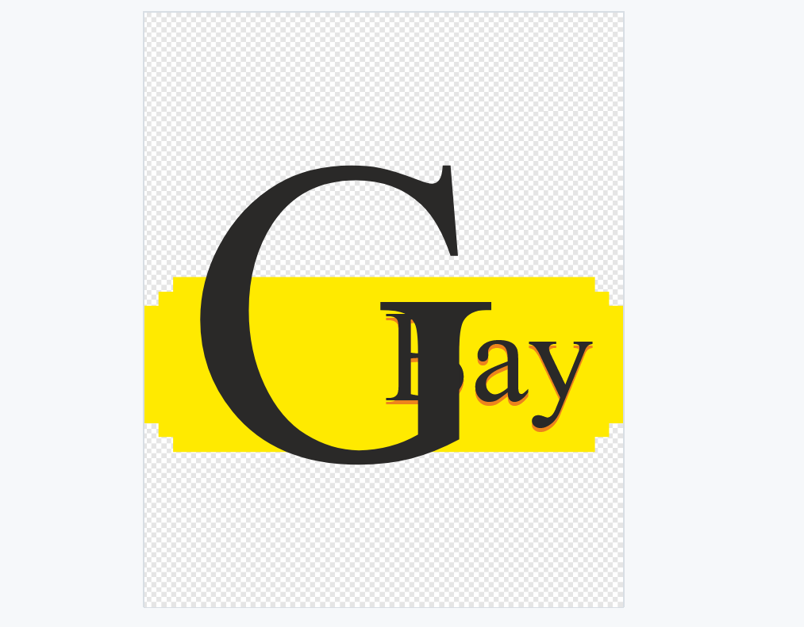
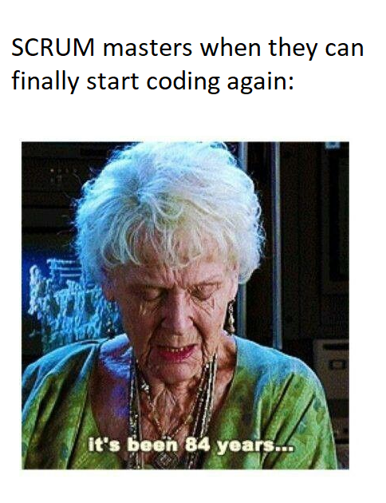
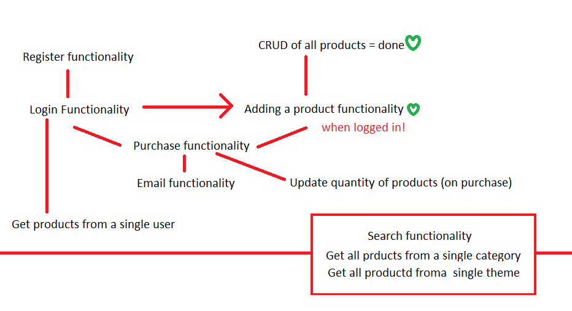
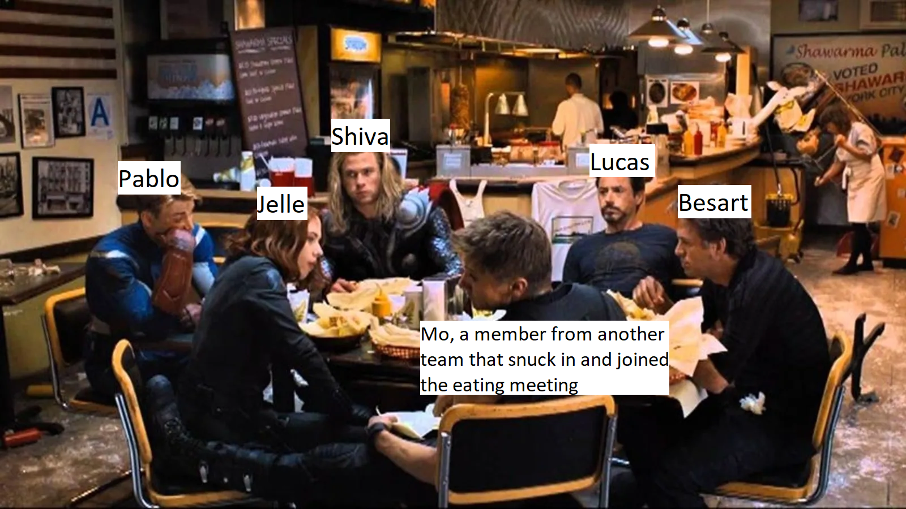

# SCRUM-ming our way to a Geeky eBay!
This assignment is a big, beefy one.
We will be working in group to create an e-Bay-like website for a client.
This is a project where the deadline is in 2 weeks.
As of now, this is the biggest assignment that BeCode has given us yet.

We will be learning how to work with SCRUM, communicating properly with a client and other developers, as well as how to plan, start and finish a big project like this.
Something very important here is that we need to decide for ourselves how we will tackle everything.
The client doesn't know how they want everything, that's for the developers to decide.

The best way to describe this assignment, is by adding my favourite BeCode meme to the README.

---

## Meet The Team

* [Shiva](https://github.com/shivamottaghi): Full-Stack Developer
* [Pablo](https://github.com/PabloGP18): Full-Stack Developer
* [Jelle](https://github.com/jelle-vdp): Lead Frontend Developer
* [Lucas](https://github.com/Gepoverlow): Lead Backend Developer
* [Besart](https://github.com/besartelezi): Scrum-Master and Full-Stack Developer

## Q&A with the Client
Here we have written down the notes we made when we had our first talk with the client.
 
### Name of the site: G-Bay

* Cool font, G-Bay as logo, color and design: very geeky, fun, interactive, flashy,...
* Bol.com functionality, looks dry and commercial, but fun interactiveness
* Amazon/2dehands for pure products, but make everything geeky
* Payments need to be clear, email confirm payment happened, payment system not needed

### Must-Haves 

* Ebay, main difference, Geeky kind of version.
* Categories: Marvel, Pokemon, ATLA, DBZ,...
* People log in and sell/buy
* product with price, pic, description
* Work smoothly on email, email confirmation to seller
* seller: your product had been bought, send to this ...
* Shopping cart, add multiple products and remove them

### Nice-to-haves

* Wish list
* Recommended section, when buying/clicking
* Purchase history
* Track previous prices of same product, prices then and now, user should be able to see prices fluctuate
* Create as much action on website as possible, on every purchase/sell, add site currency (GeekCoins)
* Sell products using GeekCoins
* Bidding System, seller need to define a buy-out price => instant purchase
* Payment: Bank-Account variable, user can add as much money as possible to it.

---

## Workflow: Flowing through our work

* Rest API/Node.JS for backend, React for front-end. 
* GitHub behaviour: Setting up small branches for big features, and add smaller branches to those for smaller features. 
* Pull requests: ask coaches => They recommend learning Pull Requests, this is a very common practice, will help avoid unintentional mistakes.
* Using Trello: When an event is done, communicate it on Discord (create pull requests).

---

## User Stories
User stories are a method for developers to create better, more concise and smaller goals for the project.
By thinking as the user, we can more concretely think of what's necessary.
So, we added some user stories for several big parts of the project, so we can split them up into smaller, more attainable goals.

### Log-in / Register
I want a login/register page on the website.
So that I'm able to register and login to the website.
Because this way I can buy stuff, I can get a notification when one of my products is sold and I can buy other products more easily.

### Product List
I want a product list.
So that I can navigate through categories and pick out the items I'd like to buy.
Because it's easier to filter what I want.

### Add new Product page
I want a method that lets me sell a product I'd like to sell.
So that I can add a product that I want to sell.
Because I want a way for the other people to see my product and be interested in buying it.

### Homepage
I want a homepage on the website.
So that I get greeted by a page that makes me immediately understand what site it is, and how it works.
Because I want to understand immediately what the website is about.

### About us page
I want an about us page.
So that I can learn more about this fun geek-alicious ebay-like website.
Because I want to be sure that I register to a website that I can trust.

### User Dashboard
I want a dashboard.
So that I can log in to the page, see all different items I am selling, add new ones, delete the ones I don't want to sell anymore or that has been sold, and update the products I'm trying to sell.
Because I want to get some $$$ from products I'm not using anymore.

### Email Confirmation
I want to receive an email when something has been sold/when I buy something.
So that I know when something has been sold.
Because I need the confirmation in order to know nothing went wrong.

---

## Day-to-Day Summaries!
Here we will write down all short summaries of what we did, how we did it, and why we did it.

### Day 1: "Developer-Team Aligos has been born!"
After Pablo assembled the Aligo-vengers, we had our very first meeting.
It was decided that we would prepare some questions for the client, since we only have one meeting with them every week and they respond slowly to emails.
After that, we started to prepare how we would tackle the backend and the frontend.
It was decided we would use a restful API and a database for the frontend, and React for the front end.

Then we decided what rules we should follow regarding our Git behaviour.
We thought using Pull requests would've been the best way, since we were all unfamiliar with it and learning is what being a developer is all about!
It's also the most professional way of working.
Afterwards, it was decided that we would add a branch called "Development".
In that branch, we would add other branches like "homepage" and the like.
Then those branches would be split up once more into smaller branches, named after every feature that would be added for that main feature.

Once that was all written out, we opened up our Trello and started writing out small and attainable goals as if our livelihood depended on it (which it will in the future).
Since it was our first time using Trello as a SCRUM board, there was some struggling, but nothing the 5 Aligos couldn't handle!
We quickly decided how we would order all tasks, how we would add more tasks when needed, and how we would start on the assignment.

All in all, it was a great first day!

### Day 2: "Our Big G(b)ay International Logo"
The second day started out like all future days will start, with a meeting.
We went over everything what was done, and what needed to be done. 
An email was sent to the client for some additional information, the database was nearly done, and there was some huge progress made in the front end.

After the meeting we also let our Lead Developers inform the rest of the team what features they added and what other features they'd like to add.
This gave the rest of the team a clearer view of what they could help with and what needs to be done.

Then right before our lunch-break, we held another meeting.
Frequent meetings is something that is very important to the Aligos.
Group up every so often so that everyone can work separately as efficient as possible, or in smaller sub-groups.

The most notable event of that day was when Besart added the logo to our repository.
He made a wonderful logo on Adobe Illustrator.
Unfortunately, he used a custom font and forgot to turn the text into outlines.
This caused a weird bug that made our logo look like this.

Luckily we were able to fix this issue in less than a minute (after ten minutes of constant laughter).
This is how the logo was supposed to look like.

This was a valuable lesson to always double-check my files before committing them to GitHub.
A funny lesson, but a lesson nonetheless!

### Day 3: "PostgreSQL V.S. MongoDB"
The third day was a day of decision-making.
After having a stand-up meeting in the morning, we decided we would swap our SQL database for a ProgreSQL database.
The other option was to use a MongoDB database.
We wanted to swap the database, because we wanted to use something that natively works with Heroku.

The main advantage of MongoDB was that it is less time-consuming.
But, if we change to MongoDB, we would waste a lot of time on creating a new database from scratch, and rewriting all the code from the backend.
So it's main advantage is nullified **immediately**.
However, this was a very nice lesson on databases.
Through this we now understand that picking the correct database at the start of the project, is very essential.

Eventually we decided on using ProgreSQL, which had its own fair share of a lot of advantages.
We did not care for the fact that it might be harder to use and a bit more time-consuming.
As a group, we decided early on that learning new stuff and learning how to work as professionally as possible are the most important parts of this assignment.
Pleasing the client is also important as well, but communicating well with the client is even more important.

Our day ended the same way it started, with a meeting.
This was needed since we wanted to check how much progress everyone made, and divide the work better if needed.

### Day 4: "Oh CRUD, it's finally the weekend!"
At the start of the project, we had set one major goal for ourselves: "To have set up a database connection".
We finished that goal on the end of day 3, and decided on a new goal the next day.
So our new goal was to have the front- and back end communicate with each other.
This is a **very** big deal, and something we will focus on from the new week onwards.

Day 4 was all about planning, and communication.
We set up yet another small goal for monday, since mondays are client-days!
The front end was looking great, so we wanted to show what we have to the client on monday.
Questions were also prepared so we can get as much information as possible from the client.

With the weekend nearing, and every single one of our members being raging workaholics, we decided to create some guidelines for us all to follow.

When working in the weekends:
* Make sure to use Trello, let everyone know who's working on what.
  * Also mention it in the discord chat
* When you're working, join the discord voice channel, even when you're not going to talk with anyone.
  * So if another member sees you working, you can help each other out!
* COMMUNICATION!!
  * Communicate with team-members and the SCRUM master when you're taking a ticket and when you're done with a ticket.

With communication being key, we have prepared yet another meme to show just how important communication is to us.

### The Weekend
Before the weekend started, we made as many small tickets as possible.
Some people like working in the weekend, while others would rather charge up their mental batteries so they can 'go ham' on the weekdays.
It all depends on the person.
The only thing that matters is to communicate properly with your team if you're working on the weekend.

We made those tickets with the people who like to work in the weekends in mind.
This way, they wouldn't accidentally work on someone else's ticket.
And because the tickets aren't big ginormous tasks, they wouldn't overwork themselves either.
Working toward your goals is important, but taking breaks is sometimes even more important.
This project is a marathon, not a race!

### Day 5: "The Return of The Client"
Today the client visited us once more.
We showed them the frond end and they loved it, they had no complaints.
Then we talked about the MVP for a bit.
This was important so the client knows what to expect when the deadline is due.
We also talked a bit about what could be scrapped in case our team has run out of time and won't be able to finish the MVP.
Personally, we believe that the MVP is very achievable, but our team believes in Murphy's Law.
If something can go wrong, it will go wrong.
So it's better to communicate and plan too much, than to not properly communicate with the client and mess things up.

Today's highlight: We made the front end, back end, and database communicate with each other properly!
The very first version of our log-in feature has been finished, but it must be first tweaked a bit and finalized.
This is one of the biggest steps of the project, and we're darn' tootin' proud that we tried so hard and got so far.
Because in the end, it definitely even mattered!

And lastly, after finishing tons of research, planning and SCRUM tickets, our SCRUM Master was also finally able to touch some code again.
This made him so happy, that he made a meme about this special occasion.

### Day 6: "Front end V.S. Back end: Civil War!"
First of all, we'd like to apologize for the title.
There was no civil war in our group, since our SCRUM Master is a ruthless dictator who rules with an iron fist and brings fear to the hearts of developers nation-wide.
Second of all, today's topic: Front and Back end!

Our back end crew used Postman!
Postman is a helpful tool that lets the back end team work without having to rely on the front end for any input.
Meanwhile, the front end very rarely needs any back end to be able to work and finish tickets.

Today we also discussed a little about the different functionalities we need to add.
There's a clear hierarchy needed when creating functionalities.
You can't purchase something without having an account, and you can't have an account without a register functionality.
That's why we came together and made this very helpful roadmap!

With this, we were able to write out some tickets.
These were the tickets that would bring us the closest to our MVP.
So as of right now, group Aligos is still going strong.
The communication be communicating, everyone's content with what they're doing, and all complaints are getting shut down by the great SCRUM Master Overlord!

### Day 7: "Database Strange: Image-Verse of Madness"
After our daily morning meeting, it was decided really quick that we need to find a way to add images to the database.
This was something that wasn't a priority, until now.
It was also more of a difficult task than we previously thought.

On the day itself we still haven't determined a clear way on how to do the images, but we were doing **a ton** of researching and experimenting.
But we did have some progress on other ends.

This day we mixed it upa  bit, by giving out some back end tasks to the developers that were more busy with the front end, and vice versa.
We thought this was essential, since we wanted all developers to understand how the project works.
It might have consumed some time, but we're confident we'll still be able to give the client a fine result at the end!

### Day 8: "Age of Breakfast: The Eating Meeting"
Today we tried something new.
Instead of the usual 'stand-up meeting', we sat down with a ton of food and held a 'eating meeting'.
Apart from being delicious, it was also a very informative meeting.
We decided that today would be the day we'd solve the database/image problem.

Thankfully, we were able to find a way to store and get images to the database.
We had 2 different methods, one was using base64 and the other was using cloudinary.
After some research, testing, and some advice from the coaches, we decided we would go with cloudinary.
So in the afternoon, our lead back end developer would focus on that, while the rest would focus on the features of the MVP.

At the end of the day, we finally succeeded in getting an image stored in the database.
This is, something the cool kids would refer to as, "a massive W".

With that out of the way, here is an accurate picture of how the eating meeting went!

### Day 9: "Aligos: Infinity War"
Day 9 was the most intense day by far.
Tickets were flying off the sprint like it was everybody's business.
The products **finally** have images.
The MVP is very nearly done, all that remains is fixing the "add a new product" functionality, the "purchase" functionality and an email confirmation.
These are all things that will be finished by monday.

This means everyone can relax during the weekend.
But if there are people that want to work on the weekend, there are more than enough tickets over for some extra features we'd like to add.

The day ended with a FriJay, which is an hour of fun game-time with any willing participants in the class.
There weren't a lot of people present, since ya know, this IS a pretty big assignment.
Nonetheless, some Aligos did join because our team needs to prove we can kick butt at everything.

Unfortunately, our SCRUM Master lost against his sworn FriJay arch-enemy by about 15 points in Scribble.
He then said he would go train in a cave hidden by a waterfall, where he would spend the remainder of his days making cave-paintings or meditating under the waterfall.
All for the sake of winning the next time in Scribble.

### Weekend 2: "Electric Boogaloo"

### Day 10: "Aligos: Endgame"

---

## The Final Finale
